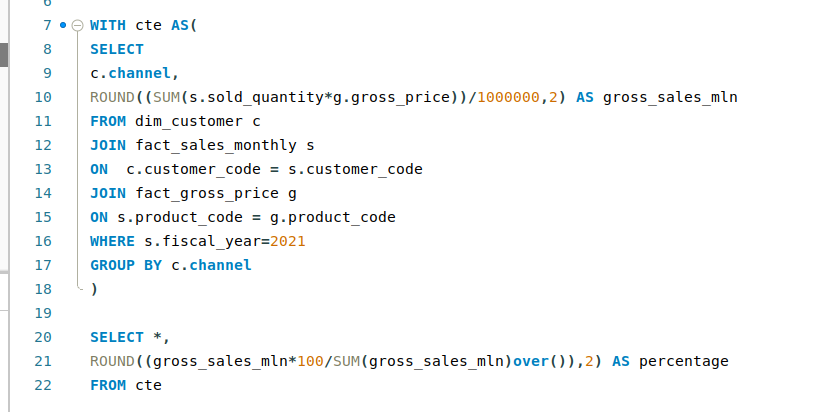

# 📊 Consumer Goods Domain - Data Insights Project (SQL)

This project focuses on generating key insights from consumer goods data using SQL, covering product trends, sales performance, and market operations for the years 2020 and 2021.

## 🌍 Project Overview

In this project, the following analyses are conducted using SQL:

- **Market Operations**: Identify markets where "Atliq Exclusive" operates in the APAC region.
- **Unique Product Growth**: Compare the increase in unique products between 2020 and 2021.
- **Segment-Wise Product Count**: Analyze product counts across different segments.
- **Product Costing**: Report on products with the highest and lowest manufacturing costs.
- **Customer Discounts**: Determine top customers receiving high discounts in the Indian market in 2021.
- **Sales Trends**: Track gross sales for "Atliq Exclusive" each month of 2021.
- **Sales Channels**: Analyze sales channels contributing the most revenue in 2021.
- **Top Selling Products**: Identify the top 3 products by division with the highest sold quantities in 2021.

## 📊 Key SQL Queries and Insights

1. **Markets for "Atliq Exclusive" in APAC**  
   SQL query to identify the markets where "Atliq Exclusive" operates in the APAC region.
    
    
   <b>Query</b> 
     
   <b>Result</b> 
   

2. **Unique Product Increase (2021 vs. 2020)**  
   SQL query to compare the increase in the number of unique products between 2020 and 2021.
    
     
   <b>Query</b> 
     
   <b>Result</b> 
   

3. **Segment-Wise Unique Product Count**  
   SQL query to analyze the unique product counts across different segments.
    
     
   <b>Query</b> 
     
   <b>Result</b> 
   

4. **Segment-Wise Product Increase (2021 vs. 2020)**  
   SQL query to compare product increase in different segments between 2020 and 2021.
    
     
   <b>Query</b> 
     
   <b>Result</b> 
   

5. **Product Costing (Highest & Lowest)**  
   SQL query to find products with the highest and lowest manufacturing costs.
    
     
   <b>Query</b> 
     
   <b>Result</b> 
   

6. **Top 5 Customers by Pre-Invoice Discount in 2021**  
   SQL query to determine the top 5 customers receiving the highest discounts in the Indian market in 2021.
    
     
   <b>Query</b> 
     
   <b>Result</b> 
   

7. **Monthly Gross Sales Report for "Atliq Exclusive" (2021)**  
   SQL query to track the gross sales for "Atliq Exclusive" for each month of 2021.
    
     
   <b>Query</b> 
     
   <b>Result</b> 
   

8. **Quarter with Maximum Total Sold Quantity (2020)**  
   SQL query to identify which quarter of 2020 had the maximum total sold quantity.
    
     
   <b>Query</b> 
     
   <b>Result</b> 
   

9. **Top Sales Channel and Contribution (2021)**  
   SQL query to analyze the sales channel that contributed the most revenue in 2021.
    
     
   <b>Query</b> 
     
   <b>Result</b> 
   

10. **Top 3 Products by Division and Sold Quantity (2021)**  
    SQL query to identify the top 3 products by division with the highest sold quantities in 2021.
     
     
   <b>Query</b> 
     
   <b>Result</b> 
   

## 🛠️ Technologies Used

- **SQL**: For querying and analyzing the data.
- **GitHub**: Project repository and collaboration.

## 📂 Repository Structure

## 🔍 Key Insights

- The **APAC region** has several key markets for "Atliq Exclusive," with noticeable sales growth.
- There was a **significant increase** in unique products from 2020 to 2021.
- Products in the **luxury and consumer electronics** segments show the highest growth.
- The **top 5 customers** in the Indian market received substantial pre-invoice discounts in 2021, indicating high-value clientele.
- **Channel X** emerged as the most significant revenue contributor in 2021.

